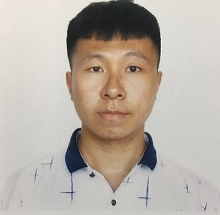

# ***Introduction to Tianyue Zhang***

There Are 4 Sections In This Introduction Page : 
1. [Personal Information](#personal-information)  
2. [Academic History](#academic-history)  
3. [Working Experience](#working-experience)
4. [Screenshots](#screenshots)

## **_Personal Information_**

- Name : (Terry) Tianyue Zhang
- Country of Birth : China 
- Pronouns : He/Him/His
- Personal Email : tianyuezhang1997@gmail.com
- UCSD Student Email : tiz013@ucsd.edu
- Phone Number : (510) 612-4174
- Favorite Sport : Soccer
- Favorite Proverb : 
> No pain, no gain - Hesperides 752  
- The First Code I Learned:
```
#include <stdio.h>

int main()
{
    printf("Hello World");

    return 0;
}
``` 
- One of My Simple Website: [reporting.tianyuezhang1997.site](https://reporting.tianyuezhang1997.site) (if interested, please contact me to be registered as a user)

## **_Academic History_**
- Intended Degree: _Bachelor of Science_
- Major : *MATH-CS* 
- Status : _Senior_
- Expected Graduation Date : June 2022 
- Colleges : 
  1. (2020-now) studying at **UC San Diego** (GPA : 3.9) 
  2. (2018-2020) studied at __Ohlone College__ (~~GPA : 4.0~~ transfered) 
  3. (2016-2018) studied at __Shenyang University of Technology__ (~~GPA : 3.6~~ transfered)
- Core Courses :
  - [ ] Principles of Computer Operating Systems
  - [ ] Software Engineering
  - [ ] Programming Languages: Principles and Paradigms
  - [ ] Discrete Mathematics and Graph Theory
  - [X] Online Database Analytics Applications
  - [X] Design and Analysis of Algorithms
  - [X] Advanced Data Structures
  - [X] Theory of Computation
  - [X] Components and Design Techniques for Digital Systems
  - [X] Programming In Java
  - [X] Programming In Assembly Language
  - [X] Object-oriented Programming (C++)
  - [X] Programming Fundamentals (C Language)
  - [X] Fundation Of Computer Organization
  - [X] Mathematics for Algorithms and Systems
  - [X] Probalility Theory And Mathematical Statistics
  - [X] Discrete Mathematics
  - [X] Numerical Analysis (Linear)
  - [X] Linear Algebra
  - [X] Mathematical Reasoning
  - [X] Differential Equations
  - [X] Calculus
  - [X] Fundamentals Of Circuit Analysis
  - [X] Physics

## **_Working Experience_**
- (2019-2020) Conduct tutoring sessions twice a week as a C++ tutor for the Computer Science department of Ohlone College

## **_Screenshots_**
Relative Links to Screenshots :   
- [clone.png](screenshots/clone.png)
- [cd_branch_checkout.png](screenshots/cd_branch_checkout.png)
- [add_commit_push.png](screenshots/add_commit_push.png)
- [VSCode_before_committing.png](screenshots/VSCode_before_committing.png)

